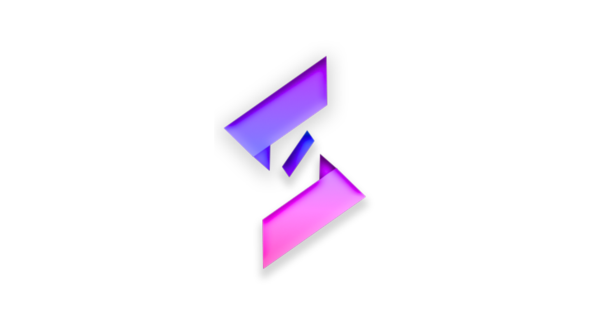

# School-Portfolio

## Team Logo

 

Above is our official team logo, which represents our identity and collaborative spirit.

## Contents

Assets – Includes all media and resources utilized in this repository.

Coursera Certificates – Official certificates awarded to team members.

User Manual – A comprehensive guide to help users navigate and make the most of the app prototype.

Part 1 – Documents from the initial planning and development phase.

Part 2 – Materials and outputs from the second stage of the project.

Part 3 – Documentation covering the third phase of development.

Part 4 – Final deliverables and documents marking project completion.